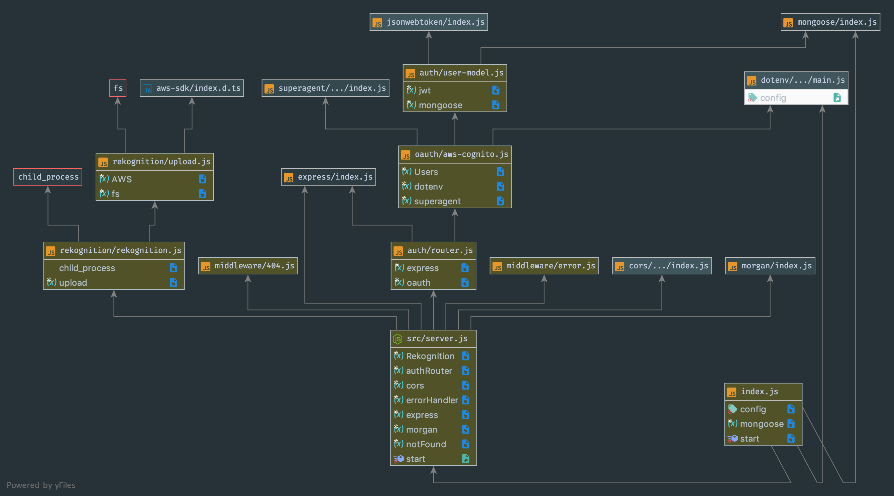

# Heeded

Authors of Project: Heeded

Lillian Gales, Evan Brecht-Curry, Eric Huang, Brad Elliot, Chance Harmon

Project Descripton:
Using Facial Recognition, develop a formula to be able to report the level of engagement from a group to assist the user in assessing the success in there speech.

Problem Domain:
As a speaker or instructor, I would like to improve my skills in captivating and holding the attention of my audience. Current technology depends on indvidual feedback from the audience, after the speech is already delivered. I would like to be able to have realtime feedback to maximize my delivery.

Problem Domain Resultions:
Using new hardware, and newly developed software, we were able to capture the audience engagement in realtime, and return feedback to the user for them to make adjustments as needed.

Version: 0.9

Libraries Used:

"dependencies": {
    "bcrypt": "^3.0.6",
    "cors": "^2.8.5",
    "dotenv": "^8.1.0",
    "ejs": "^2.7.1",
    "express": "^4.17.1",
    "jsonwebtoken": "^8.5.1",
    "mongod": "^2.0.0",
    "mongoose": "^5.7.0",
    "morgan": "^1.9.1",
    "multer": "^1.4.2",
    "multer-s3": "^2.9.0",
    "nodemon": "^1.19.2",
    "requirejs": "^2.3.6",
    "superagent": "^5.1.0",
    "uuid": "^3.3.3",
    "aws-sdk": "^2.527.0",
    "body-parser": "1.18.3",
    "cookie-parser": "1.4.3",
    "fs-extra": "6.0.1",
    "node-uuid": "1.4.8",
    "path": "0.12.7"
  }
Current Libraries Used

Technologies Used:
Rasberry Pi
Webcam
Node.js
AWS Cognito
AWS S3 Bucket
AWS Rekognition

User Reqs:
Have our Pi, a webcam, an AWS account, a verifiable email, and fortitude.

Work Flow:
By intializing localhost3000, you will be directed to AWS Cognito to sign in or sign up. From there it will take you the dynamic results page where will begin to see live feedback. The process is that once Oauth is completed, it triggers the Pi to start taking pictures, and begins sending those photos to the S3 bucket. As soon the S3 Bucket recieves a photo, our function retrieves the photo, passes it along to AWS Rekognize for facial analyisis. Rekognize sends us back a JSON object of the analyisis, we parse through the data, picking out what we have determined to be our magic formula. After we pass the data through the formula, the ouput value is plotted on a graph in realtime, using an aggregate of how many faces deteced versus how many are engaged.

 #### UML

